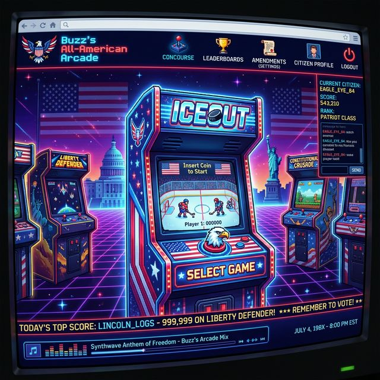
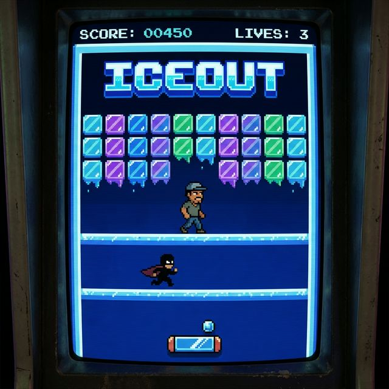

# Design Document: Buzz's All-American Arcade

## 1. System Architecture

The project employs a dual-stack configuration combining a modern frontend framework with an established 2D game library compiled to WebAssembly (WASM).
- **Host Application**: React + Vite (SPA). Serves as a dynamic wrapper offering a rich UI. Handles game selection and frame routing.
- **Game Engine**: Python + Pygame CE. Translated to the browser via `pygbag` into standard HTML/WASM formats.
- **Integration Layer**: Standard `<iframe>` isolation.

This design supports future scaling, permitting any WebGL or HTML5-compatible game code to be slotted into new arcade cabinets seamlessly without migrating or rebuilding the main React shell.

## 2. Technical Decisions

1. **Why Pygame CE + pygbag for browser delivery?**
   Because Pygame natively lacks an efficient browser target, community extensions (like Pygame CE) merged with `pygbag` allow raw Python code describing 60fps logic to be wrapped in a standard `game.apk` format that the browser extracts into memory securely.

2. **Why static deployment (GitHub Pages)?**
   The MVP operates strictly off client state. Providing no authentication means no server overhead and zero database hosting costs. Vite offers easy static builds using `npm run build` combined with the `gh-pages` module.

## 3. Visual Design System

- **Mode**: Dark-first typography using 'Outfit' and 'Press Start 2P' from Google Fonts.
- **Theming**: "Democracy Meets Synthetic 80s". Patriotism styled exclusively through a Cyberpunk/Arcade lens. 
- **Palette**: Neon Blue (`#00f3ff`), Neon Red (`#ff003c`), Glass Backgrounds (`rgba(10, 15, 30, 0.7)`), and subtle CRT scanlines overlaid via CSS `::before` pseudo-classes.

### Embedded Mockups from Google Stitch
Our UI Researcher "Stella" developed these foundational wireframes based on MVP requirements:

**A. Buzz's All-American Arcade (Concourse View)**
The entry page shows the general look, cabinet selections, and themed navigation.

**B. IceOut (Gameplay Concept)**
The vertical game view. As noted during Discovery, the *IceOut* title logo is reserved for the "Attract" screen. During live gameplay, the latino/a family members reside directly above the ice blocks waiting to be freed.

## 4. Game Module Design (IceOut)

- **Screen Setup**: A 3:4 vertical Aspect Ratio representing an old-school upright cabinet.
- **Entities**: 
  - **Paddle**: Keyboard controlled (A/D or Left/Right).
  - **Ball**: Basic linear algebra bounce logic.
  - **Blocks**: Melty ice visuals arranged in grids. Collision removes blocks.
  - **Family Member**: Walks left/right above the blocks. Drops safely via gravity if the ice floor opens beneath them.
  - **Villain**: Periodically spawns halfway across the screen and sprints across. Ball collision grants 5x points.

## 5. Deployment Setup

We will configure GitHub Pages to look at either the `/docs` or the built branch generated by `npm run deploy` via standard Vite protocol.
